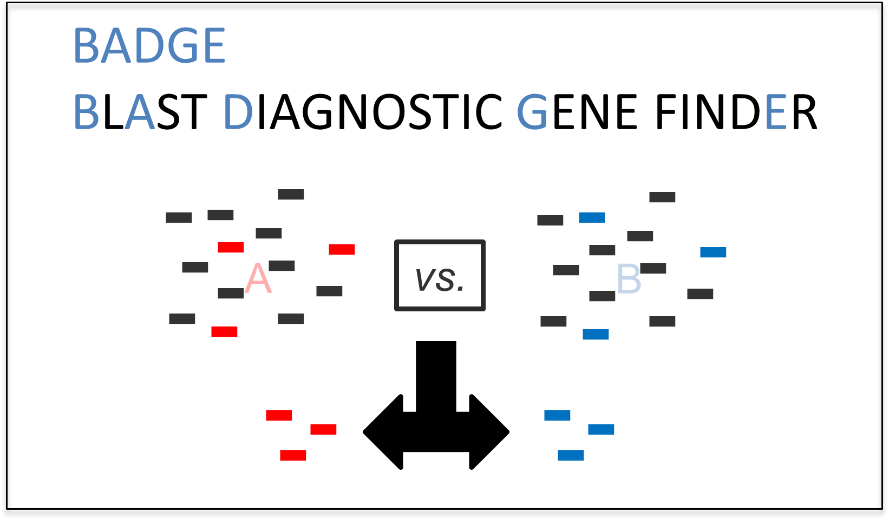
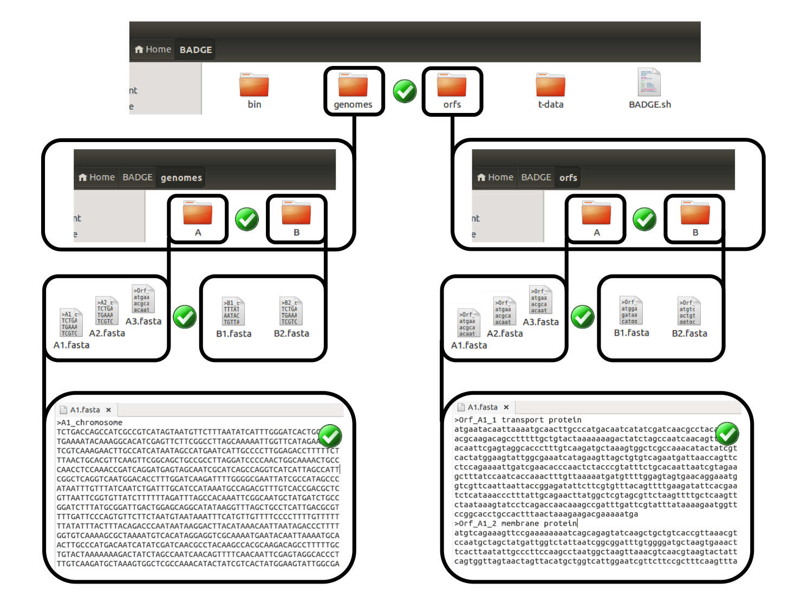
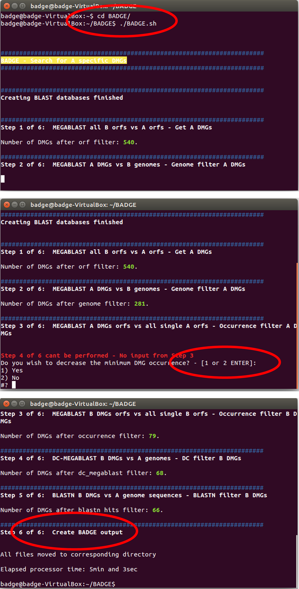
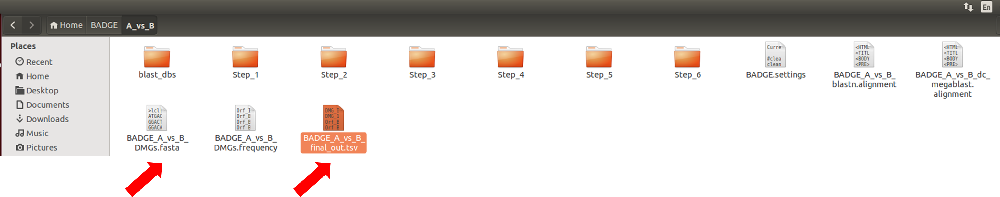
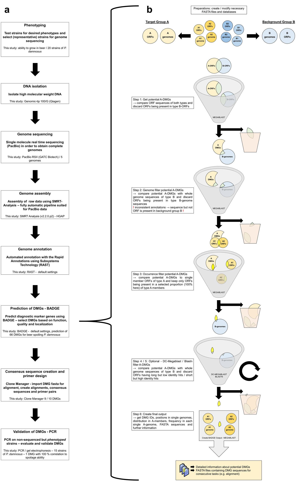

## Description
**BlAst Diagnostic Gene findEr (BADGE)** is an open source tool for the rapid identification of diagnostic marker genes (DMGs) for the differentiation of two or more bacterial groups of the same or different species. BADGE is programmed for Unix-based operating systems (OS) like Linux (Ubuntu, Mint, etc.) and MAC OS X. It can be easily installed also on Windows computers using a virtual Linux guest system. This short introduction describes the installation and execution of BADGE. Its basic functionality is depicted in [figure 4](#anchor4). For detailed instructions, please refer to the manual.

**Citing BADGE:** Behr, J., A. J. Geissler, J. Schmid, A. Zehe and R. F. Vogel (2016). "The Identification of Novel Diagnostic Marker Genes for the Detection of Beer Spoiling *Pediococcus damnosus* Strains Using the BlAst Diagnostic Gene findEr." [PLoS One 11(3): e0152747](http://dx.doi.org/10.1371/journal.pone.0152747).

# Quick Start – for Linux Systems

###1.	Install BADGE on a Linux OS and check installation
NOTE: **NAMING CONVENTIONS** → avoid the usage of **special characters and spaces** when naming files!!!!!
***
<ol type="a">
<li>Download Linux version of BADGE from https://github.com/TMW-bioinformatics/BADGE/releases and extract it to your home directory (home/your-home-directory/BADGE) </li> 

<li>Start check_BADGE.sh within the home/your-home-directory/BADGE/t-data directory from command line using a terminal (command: ./check_BADGE.sh) </li> 
 
<li>If your installation was successful proceed to item 2 of the quick guide </li>

<li>If you need a more detailed instruction → see manual section Step-by-Step guide starting with Step 3 (for Linux) </li>

<li>NOTE: You can copy your BADGE folder (and rename to BADGE2, 3 etc.) as often as desired and run multiple instances in parallel. </li>
</ol>

###2.	Running BADGE  

NOTE: It is **all about naming of files and folder** - First see the graphical illustration ([figure 1 - 4](#anchor1)) below! Also have a look at the data structure of the example from the publication within BADGE/t-data/Pdam_set → genomes and orfs.
***
<ol type="a">
<li>Create 2 folders (genomes & orfs) within home/your-home-directory/BADGE → home/your-home-directory/BADGE/genomes and home/your-home-directory/BADGE/orfs </li> 

<li>Create folders (cf. figure 1; at least 2) corresponding to your groups (e.g. A & B) (identically named folders) within home/your-home-directory/BADGE/genomes and home/your-home-directory/BADGE/orfs → e.g. home/your-home-directory/BADGE/genomes/A, home/your-home-directory/BADGE/orfs/A home/your-home-directory/BADGE/genomes/B, home/your-home-directory/BADGE/orfs/B  </li> 

<li>Provide necessary fasta-files → for each strain 1 file containing the genome (contigs) and 1 file containing the open reading frames (ORFs) → move them to the respective directory (genomes / orfs and group A / B) and rename them identically, always ending with the file-ending .fasta → e.g. home/your-home-directory/BADGE/genomes/A/A1.fasta, home/your-home-directory/BADGE/orfs/A/A1.fasta  </li>

<li>Start BADGE.sh (figure 2) within the home/your-home-directory/BADGE directory from command line using a Terminal (command: ./BADGE.sh)  </li>

<li>NOTE: In case no DMGs are found with current settings for minimum DMG occurrence, BADGE can be interactive, waiting for your input –→ BADGE will ask you if you want to set a new value for the parameter or proceed with no changes </li>  

<li>Key results will be found in a file like BADGE_A_vs_B_final_out.tsv (A vs B will be replaced by your group names) using a spreadsheet application, sequences can be found in the corresponding fasta-file (BADGE_A_vs_B_DMGs.fasta) and opened using a text editor (c.f. figure 3) </li>
</ol>


Figure 1: Data requirements for BADGE. **Naming and structure are important** for BADGE to work. Corresponding folders and files within genomes and orfs directory have to be named identically. Avoid any spaces or special characters. **NOTE: fasta headers need not be modified** 


 
Figure 2: Running BADGE. Move to BADGE directory (cd command) and execute BADGE.sh (./BADGE.sh). Interact with script in case your chosen minimum DMG occurrence results in no DMGs


 
Figure 3: Output of BADGE. Key results can be found within a directory named as the comparison calculated (here A\_vs\_B). The central file, BADGE_A\_vs\_B\_final\_out.tsv contains the most important data about the identified DMGs and can be viewed and modified using a spreadsheet application.

Figure 4: The use-oriented prediction of diagnostic marker genes using BADGE. (a) Workflow illustrating the structure of a comparative genomics project with the aim to identify and validate diagnostic marker genes (DMGs). Each box corresponds to a single step within the straightforward procedure. (b) The prediction of group A specific DMGs is shown using a fictive example with two members of group A and two members of group B. A description of all steps can be found in the corresponding boxes. Genome = here: sequences of chromosome and all extrachromosomal elements (contigs); ORFs = open reading frames, here: sequences of all ORFs; DMG = diagnostic marker gene (Behr, J., A. J. Geissler, J. Schmid, A. Zehe and R. F. Vogel (2016). "The Identification of Novel Diagnostic Marker Genes for the Detection of Beer Spoiling Pediococcus damnosus Strains Using the BlAst Diagnostic Gene findEr." PLoS One 11(3): e0152747.)

makeblastdb BUG-FIX for version 1.0: If you are working with fasta files containing multiple Ns (ambiguous bases), BADGE won’t proceed after the database creation. This is a problem with the included makeblastdb binary and can be fixed by replacing the makeblastdb binary within BADGE with a new makeblastdb binary. Just download the latest blast+ package for your respective operating system and copy the makeblastdb binary into BADGE/bin > check yes for replace the old one. This will be additionally fixed within BADGE version 1.1, as soon as this version will be available. Thanks for your patience!

#Licence - GPL  
This program is free software: you can redistribute it and/or modify it under the terms of the GNU General Public License as published by the Free Software Foundation, either version 3 of the License, or (at your option) any later version. This program is distributed in the hope that it will be useful, but without any warranty; without even the implied warranty of merchantability or fitness for a particular purpose. See the GNU General Public License for more details. You should have received a copy of the GNU General Public License along with this program. If not, see http://www.gnu.org/licenses/.  

Third party binaries were obtained from NCBIs BLAST+ toolkit (Public Domain) and the EBI exonerate toolkit (GPL). Both are free software. For licenses see the corresponding toolkits and documentations. They are also included in the BADGE/bin directory. In case of the MAC version GNU grep is also included into the binaries and is GPL3 licensed.  
BLAST+: http://blast.ncbi.nlm.nih.gov/Blast.cgi?PAGE_TYPE=BlastDocs&DOC_TYPE=Download  
Exonerate: https://www.ebi.ac.uk/~guy/exonerate/
